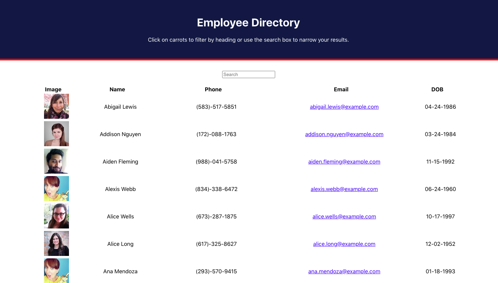
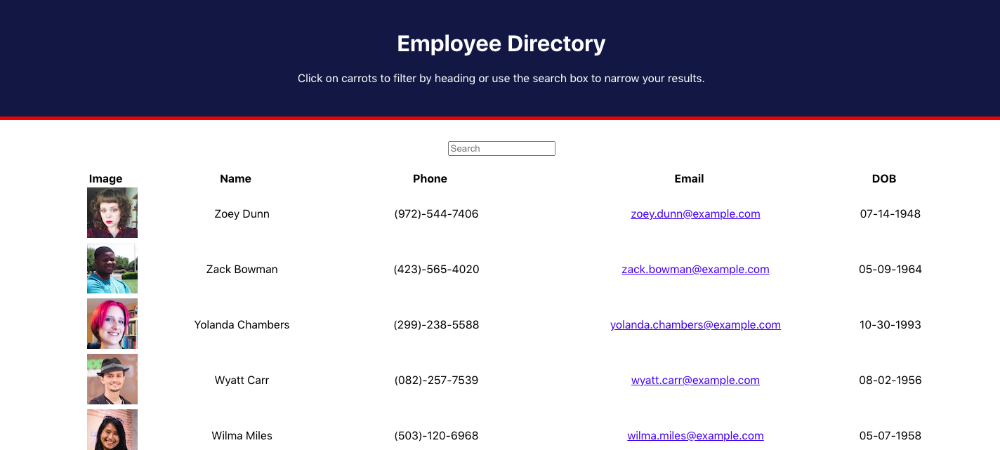
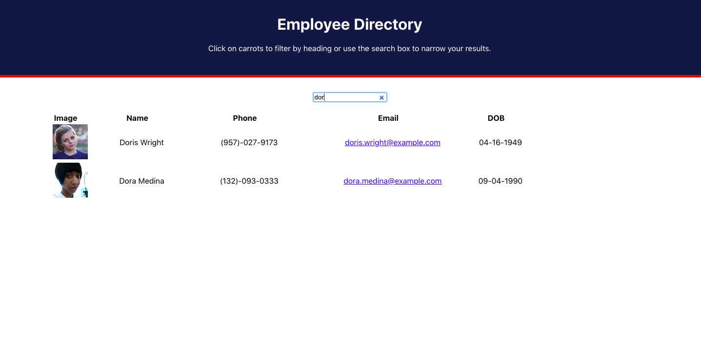

# Employee Directory

## Description

This applications allows the  user to view  their entire employee directory using React. The user can sort their employees information by their name or they can search them in the search bar.
 ## Click [here](https://employee-directory4.herokuapp.com/) for the live app.  
 
 This is the home page:
 
  
 
 Clicking on the right side of the employees name will sort their names by alphabetical order:
 
 
  
 
 Users can also search for specific employees by name and get narrowed results:
 
 
  
 
## Badges

## Installation

     
     - axios 
     - moment
     - react
     - react-dom
     - react-scripts

## Email:

        bml201095@gmail.com
